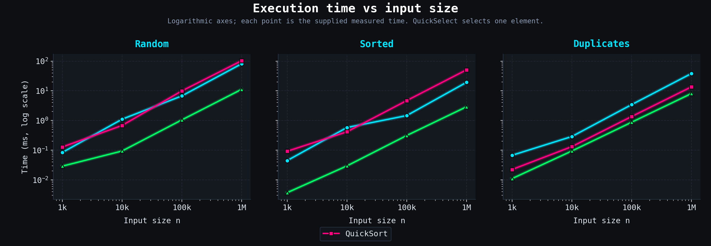
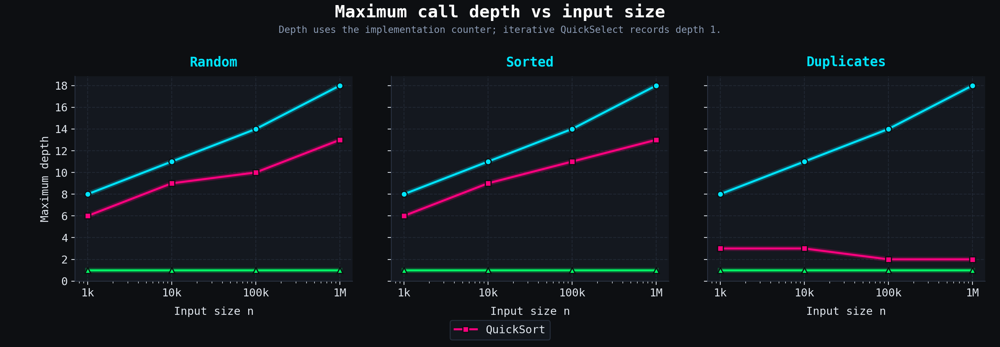
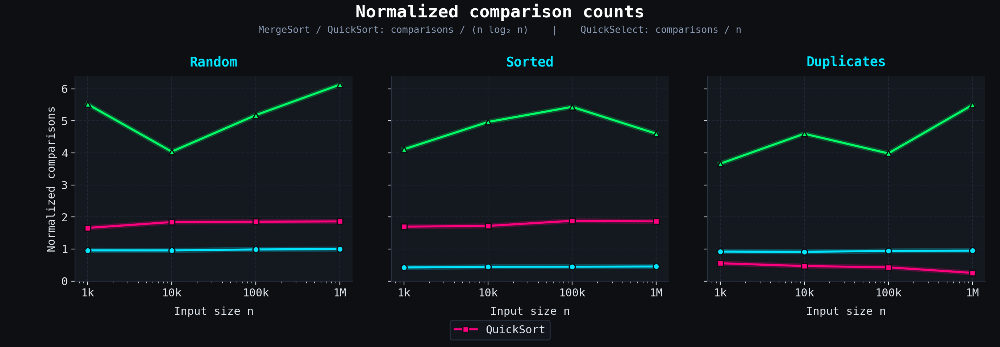

# Assignment 1: Divide and Conquer

## 1. Objective

The goal of this assignment is to implement MergeSort, QuickSort,
and QuickSelect and compare their performance.
The measured metrics are execution time, element comparisons,
and maximum call depth.

## 2. Experimental Setup

- Programming language: Java 25
- Build system: Maven
- Testing framework: JUnit 5
- Array sizes: 1,000; 10,000; 100,000; 1,000,000
- Input types: random, sorted, and duplicates

MergeSort and QuickSort sort the entire array.
QuickSelect finds the element at a selected index in sorted order
without sorting the entire array.

## 3. Benchmark Plots

### Execution Time

### Maximum Call Depth

### Normalized Comparisons

For MergeSort and QuickSort, comparisons are divided by n * log2(n).
For QuickSelect, comparisons are divided by n.

## 4. Time Complexity

| Algorithm | Best case | Average / expected case | Worst case |
|-----------|-----------|-------------------------|------------|
| MergeSort | Θ(n log n) | Θ(n log n) | Θ(n log n) |
| QuickSort, distinct elements | Θ(n log n) | Θ(n log n), expected | Θ(n²) |
| QuickSelect | Θ(n) | Θ(n), expected | Θ(n²) |
| InsertionSort | Θ(n) | Θ(n²) | Θ(n²) |

### Explanation

MergeSort divides the array into two halves and merges them.
Each level performs Θ(n) work, and there are Θ(log n) levels.
The fixed insertion-sort cutoff changes constants but not the
asymptotic bound.

QuickSort performs linear partitioning. Balanced partitions give
Θ(n log n) time. Random pivots give expected Θ(n log n) time for
distinct elements, but repeatedly unbalanced partitions can
still cause Θ(n²) time.

Our QuickSort uses three-way partitioning. Equal elements are
grouped together and excluded from further processing.
For an array of equal elements, it finishes in Θ(n) time.
Therefore, the distinct-element best-case bound does not describe
every input with duplicates.

QuickSelect processes only the partition containing the desired
element. Its expected time is Θ(n). Repeatedly retaining almost
the entire array can cause Θ(n²) time.

InsertionSort takes Θ(n) time on an already sorted array because
each element needs only one comparison with its predecessor.
Random and reverse-sorted arrays require Θ(n²) work on average
and in the worst case, respectively.

## 5. Recurrences and the Master Theorem

### MergeSort

T(n) = 2T(n/2) + Θ(n)

Here, a = 2, b = 2, and f(n) = Θ(n).
Since n^(log_b(a)) = n, Master Theorem case 2 gives:

T(n) = Θ(n log n)

### QuickSort: Balanced Partitions

T(n) = 2T(n/2) + Θ(n)

Master Theorem case 2 gives Θ(n log n) for balanced partitions
with distinct elements.

This balanced recurrence is not a proof of the randomized
expected bound. Actual partition sizes depend on the pivot.

In the worst case:

T(n) = T(n - 1) + Θ(n) = Θ(n²)

The standard Master Theorem does not apply to this recurrence.

### QuickSelect: Balanced Partitions

T(n) = T(n/2) + Θ(n)

Here, a = 1, b = 2, and n^(log_b(a)) = 1.
The linear partitioning work dominates, and the regularity
condition holds. Master Theorem case 3 gives:

T(n) = Θ(n)

This models balanced reductions in the remaining problem size,
even though our implementation uses a loop.

In the worst case:

T(n) = T(n - 1) + Θ(n) = Θ(n²)

The balanced recurrence alone does not prove the randomized
expected bound.
## 6. Experimental Results

For n = 1,000,000, the measured execution times were:

| Input | MergeSort (ms) | QuickSort (ms) | QuickSelect (ms) |
|-------|---------------|----------------|------------------|
| Random | 81.5022 | 103.2652 | 11.2035 |
| Sorted | 19.2938 | 50.8898 | 2.8925 |
| Duplicates | 38.2099 | 13.5302 | 8.0737 |

MergeSort was faster than QuickSort on the largest random and
sorted inputs in this experiment. QuickSort was faster on the
largest duplicate-heavy input.

QuickSelect had the lowest measured time in each case, but it
solves a different problem: selecting one element rather than
sorting the entire array.

### Call Depth

MergeSort's maximum depth increased from 8 to 18 as n increased
from 1,000 to 1,000,000. This is consistent with logarithmic growth.

QuickSort reached depth 13 on the largest random and sorted
inputs. Recursing on the smaller partition and processing the
larger partition with a loop limits stack growth.

QuickSelect recorded depth 1 for every input size because its
implementation is iterative. This does not mean it performs
only one partitioning step.

## 7. Empirical Growth Bounds

Let C(n) be the number of element comparisons.
The following constants satisfy

c1 * g(n) <= C(n) <= c2 * g(n)

at all four measured sizes, starting at n0 = 1,000.

| Algorithm | Input | g(n) | c1 | c2 |
|-----------|-------|------|----|----|
| MergeSort | Random | n log2(n) | 0.94 | 1.01 |
| MergeSort | Sorted | n log2(n) | 0.42 | 0.46 |
| MergeSort | Duplicates | n log2(n) | 0.91 | 0.96 |
| QuickSort | Random | n log2(n) | 1.65 | 1.87 |
| QuickSort | Sorted | n log2(n) | 1.69 | 1.89 |
| QuickSort | Duplicates | n | 5.10 | 7.13 |
| QuickSelect | Random | n | 4.03 | 6.14 |
| QuickSelect | Sorted | n | 4.11 | 5.44 |
| QuickSelect | Duplicates | n | 3.66 | 5.50 |

These are empirical bounds for the sampled sizes, not a proof
that the inequalities hold for every n >= n0.

MergeSort's normalized comparison counts remain approximately
constant, supporting n log n growth.

QuickSort shows similar behavior on random and sorted inputs.
For duplicates drawn from only ten possible values, three-way
partitioning removes equal elements together. Its measurements
are consistent with linear growth for this fixed-value-range
input family. Consequently, comparisons / (n log2(n)) decreases.

QuickSelect's comparisons / n stays within a bounded range in
these measurements, supporting its expected linear behavior.

## 8. Discussion and Limitations

1. Execution time depends on the computer and background activity.
2. JVM warm-up and JIT compilation can change timings, especially
   for small inputs.
3. Garbage collection may introduce pauses during measurements.
4. CPU caching and branch prediction can affect performance even
   when comparison counts are similar.
5. MergeSort's insertion-sort cutoff reduces recursive overhead
   for small subarrays without changing its asymptotic complexity.
6. Random pivot choices cause QuickSort and QuickSelect comparison
   counts to vary between runs.
7. The benchmark uses two warm-up runs and the median time of five
   measured runs; the reported comparisons and depth belong to
   the run with that median time.
8. Four input sizes and three input families provide useful
   evidence, but cannot establish asymptotic bounds by themselves.

## 9. Conclusion

The measurements are consistent with n log n comparison growth
for MergeSort and for QuickSort on random and sorted inputs.
Three-way QuickSort benefits substantially from duplicate values.
QuickSelect shows approximately linear comparison growth while
using constant call depth in the iterative implementation.
The results demonstrate why input distribution, implementation
choices, and the task being solved all matter when comparing
algorithms.